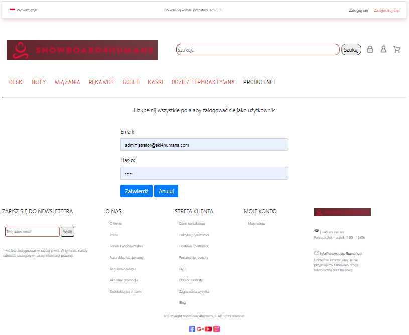
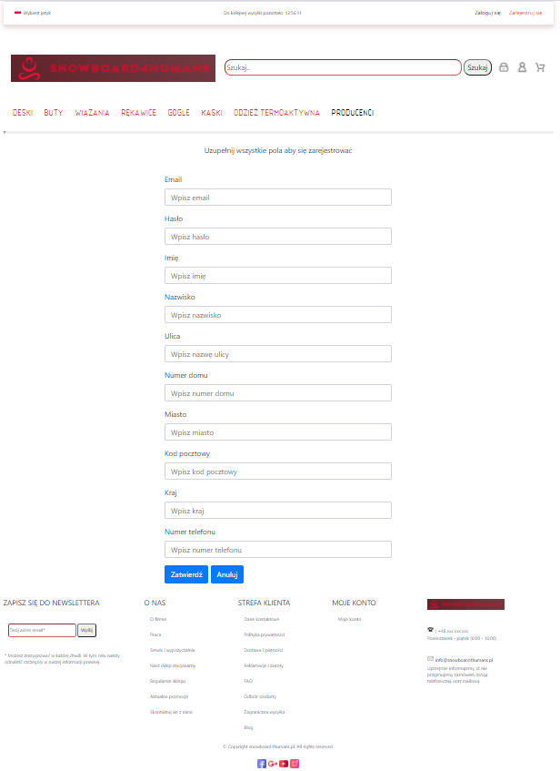

# Snowboard 4 humans - website
## 1 Introduction
_Website with accessories for snowboard. This application was created to train JAVA backend, while the frontend was created in order to present the progress._
_It is not website for any existing shop_

Frontend of page was based on https://snowboardowy.pl/.

## 2 Table of Contents
- [Introduction](#1-Introduction)
- [Table of Contents](#2-Table-of-Contents)
- [How to run ?](#3-how-to-run-)
- [Description of user pages and admin pages](#4-Description-of-user-pages-and-admin-pages)
  - [Homepage - for users](#41-Homepage---for-users)
    - [Homepage - Navigation Bar](#411-Homepage---navigation-Bar)
    - [Homepage - Equipment exist in DB](#412-Homepage---Equipment-exist-in-DB)
    - [Homepage - Equipment not exist in DB](#413-Homepage---Equipment-not-exist-in-DB)
    - [Homepage - Manufacturers](#414-Homepage---Manufacturers)
    - [Homepage - Search Button](#415-Homepage---Search-Button)
    - [Homepage - Login page](#416-Homepage---Login-page)
    - [Homepage - Register page](#417-Homepage---Register-page)
    - [Homepage - Shopping cart](#418-Homepage---Shopping-cart)
    - [Homepage - Shopping cart empty](#419-Homepage---Shopping-cart-empty)
    - [Homepage - Shopping cart - continue order without logging](#4110-Homepage---Shopping-cart---continue-order-without-logging)
    - [Homepage - Equipment View](#4111-Homepage---Equipment-View)
    - [Homepage - Shopping cart - continue order when logged - part 1](#4112-Homepage---Shopping-cart---continue-order-when-logged---part-1)
    - [Homepage - Shopping cart - continue order when logged - part 2](#4113-Homepage---Shopping-cart---continue-order-when-logged---part-2)
    - [Homepage - Shopping cart - continue order when logged - part 3](#4114-Homepage---Shopping-cart---continue-order-when-logged---part-3)
  - [Homepage - for admins](#42-Homepage---for-admins)
    - [Homepage - login page](#421-Homepage---login-page)
    - [Homepage - Navigation Bar - part 1](#422-Homepage---Navigation-Bar---part-1)
    - [Homepage - Navigation Bar - part 2](#423-Homepage---Navigation-Bar---part-2)
    - [Homepage - Equipment not exist in DB](#424-Homepage---Equipment-not-exist-in-DB)
    - [Homepage - Equipment exist in DB](#425-Homepage---Equipment-exist-in-DB)
    - [Homepage - Create new equipment](#426-Homepage---Create-new-equipment)
    - [Homepage - View selected equipment](#427-Homepage---View-selected-equipment)
    - [Homepage - Enable actions for selected equipment](#428-Homepage---Enable-actions-for-selected-equipment)
    - [Homepage - Update/ Edit selected equipment](#429-Homepage---Update---Edit-selected-equipment)
    - [Homepage - Delete selected equipment](#4210-Homepage---Delete-selected-equipment)
    - [Homepage - Navigation Bar - part 3 - Manufacturer](#4211-Homepage---Navigation-Bar---part-3---Manufacturer)
    - [Homepage - Navigation Bar - part 4 - Users](#4212-Homepage---Navigation-Bar---part-4---Users)
    - [Homepage - Navigation Bar - part 5 - Category](#4213-Homepage---Navigation-Bar---part-5---Category)
    - [Homepage - Navigation Bar - part 6 - Clients](#4214-Homepage---Navigation-Bar---part-6---Clients)
    - [Homepage - Navigation Bar - part 7 - Reviews](#4215-Homepage---Navigation-Bar---part-7---Reviews)
    - [Homepage - Navigation Bar - part 8 - Orders](#4216-Homepage---Navigation-Bar---part-8---Orders)
    - [Homepage - Orders View Page](#4217-Homepage---Orders-View-Page)
    - [Homepage - Users View Page](#4218-Homepage---Users-View-Page)
    - [Homepage - Page not exist/ DB error](#4219-Homepage---Page-not-exist---DB-error)
- [TODO list](#5-TODO-list)
## 3 How to run ?

Download from this link: https://github.com/berNy92k/Snowboard4HumansWebApp_DB and run using for example Intellij

or

use link from heroku: TODO

## 4 Description of user pages and admin pages
Below you will be able to see short description with images for:

- user pages
- admin pages

### 4.1 Homepage - for users
Screens with homepage view for clients/ users.

##### 4.1.1 Homepage - Navigation Bar
User can choose the type of equipment and gender.

 *the type of equipment 
 - snowboards
 - snowboard shoes
 - snowboard bindings
 - snowboard gloves
 - snowboard helmets
 - thermoactive clothing
 - manufacturers
 
 *gender
 - For Men
 - For Women
 - For Childen
 

##### 4.1.2 Homepage - Equipment exist in DB 
Example after select equipment type with gender - when equipments exist in DB

##### 4.1.3 Homepage - Equipment not exist in DB
Example after select equipment type with gender - when equipments not exist in DB

##### 4.1.4 Homepage - Manufacturers
Example page with manufacturers.

##### 4.1.5 Homepage - Search Button
Example how search button is working.

 ##### 4.1.6 Homepage - Login page
 Example of login page. Necessary to finish order in the shop.
 

 
-
 
 ##### 4.1.7 Homepage - Register page
 Example of register page. Necessary to login and finish order in the shop.
 

 
 ##### 4.1.8 Homepage - Shopping cart
-
 
 ##### 4.1.9 Homepage - Shopping cart empty
-
 
 ##### 4.1.10 Homepage - Shopping cart - continue order without logging
-
 
 ##### 4.1.11 Homepage - Equipment View
 Example of equipment view page. Below you can see also reviews/ comments by other clients.
 To add any reviews/ comments it is necessary to login.
 
-
 
-
 
 ##### 4.1.12 Homepage - Shopping cart - continue order when logged - part 1
 After press 'Zakup' in Shopping Cart user will see next page.
 
 User is asked to fill fields with information about shipping address (fields are filled automatically from 
 client account but it can be change during order - shipping address is not always the same like client address)
 
-
 
 ##### 4.1.13 Homepage - Shopping cart - continue order when logged - part 2
 Summary of shopping cart and shipping address.
 
 Client should check if all data are correct and press 'Przejdź dalej'.
 
-
 
 ##### 4.1.14 Homepage - Shopping cart - continue order when logged - part 3
 Order is finished. Message with this information is display on the screen.
 
-
 
### 4.2 Homepage - for admins
Screens with homepage view for admins

##### 4.2.1 Homepage - login page
Before admin will be able to do anything it is necessary to login.

-

##### 4.2.2 Homepage - Navigation Bar - part 1
User can choose the type of equipment/gender and other information important for administrators.

 *the type of equipment 
  - snowboards
  - snowboard shoes
  - snowboard bindings
  - snowboard gloves
  - snowboard helmets
  - thermoactive clothing
  - manufacturers
  - other information
    - users
    - category
    - clients
    - reviews
    - orders
 
 *gender
 - For Men
 - For Women
 - For Childen
 
-

##### 4.2.3 Homepage - Navigation Bar - part 2
When admin press one of the button (snowboards, snowboards shoes, snowboards bindings, snowboards gloves, snowboards helmets, thermoactive clothing) 
it will load new page with 4 options: 

- All 'xx'
- 'xx' for woman
- 'xx' for man
- 'xx' for child

Note: 'xx' - name of equipment that was chosen

-

##### 4.2.4 Homepage - Equipment not exist in DB 
-

##### 4.2.5 Homepage - Equipment exist in DB 
-

##### 4.2.6 Homepage - Create new equipment
-

##### 4.2.7 Homepage - View selected equipment
-

##### 4.2.8 Homepage - Enable actions for selected equipment
-

##### 4.2.9 Homepage - Update - Edit selected equipment
-

##### 4.2.10 Homepage - Delete selected equipment
-

##### 4.2.11 Homepage - Navigation Bar - part 3 - Manufacturer
-

##### 4.2.12 Homepage - Navigation Bar - part 4 - Users
-

Can not delete/ update main ADMIN account - it will throw error if somebody will try to delete/ update admin with id = 1

-

##### 4.2.13 Homepage - Navigation Bar - part 5 - Category
-

##### 4.2.14 Homepage - Navigation Bar - part 6 - Clients
-

##### 4.2.15 Homepage - Navigation Bar - part 7 - Reviews
-

##### 4.2.16 Homepage - Navigation Bar - part 8 - Orders
-

##### 4.2.17 Homepage - Orders View Page
-

##### 4.2.18 Homepage - Users View Page
-

##### 4.2.19 Homepage - Page not exist - DB error

Page not exist:

-

For DB error (500) page looks similar but with different error number.

## 5 TODO list
* Create website by using SpringBoot and Thymeleaf
* Update README.md
