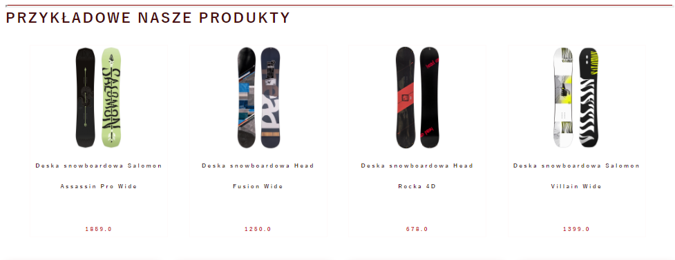
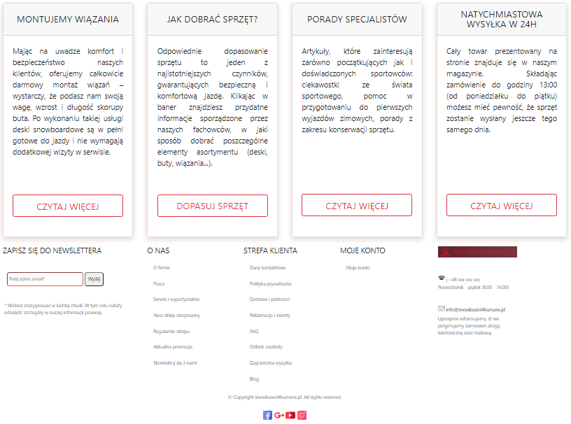
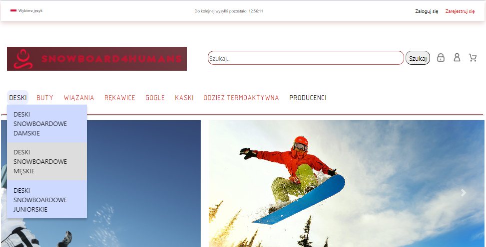
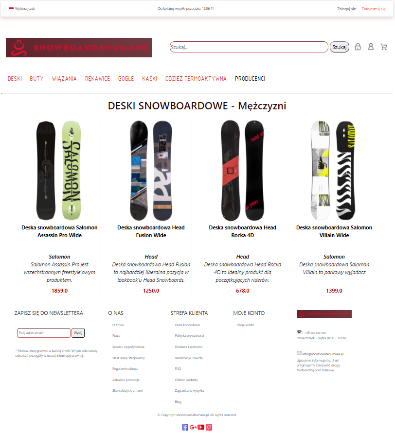
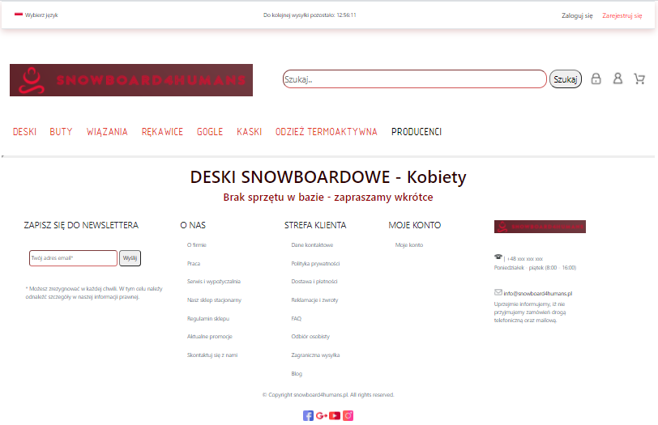
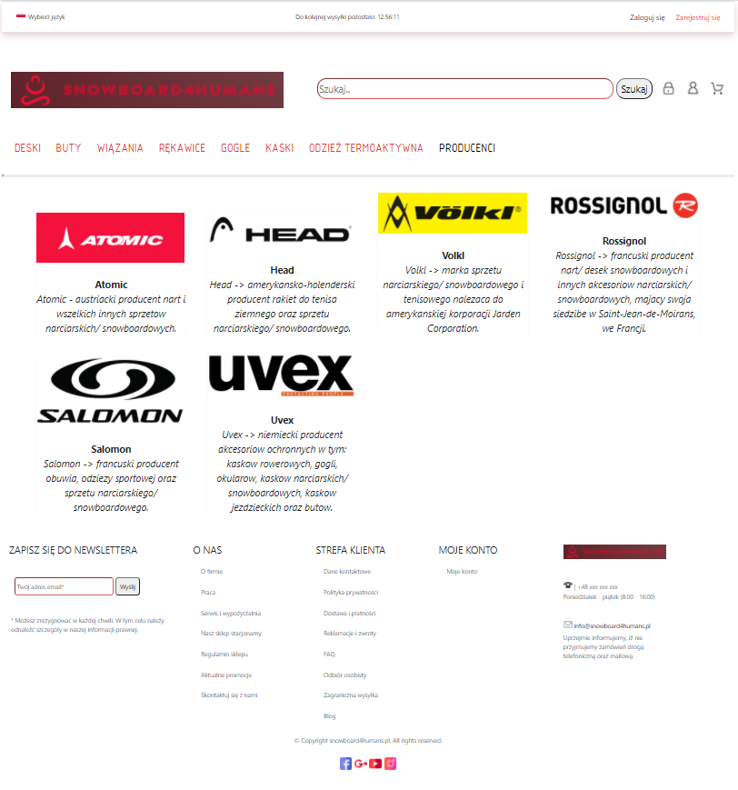
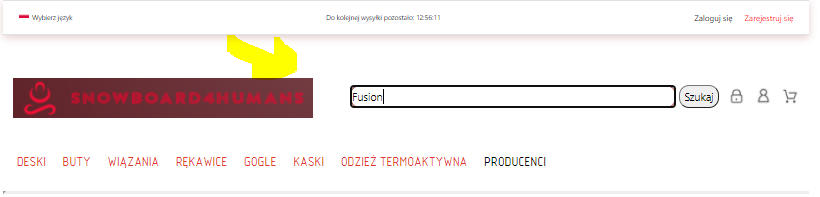
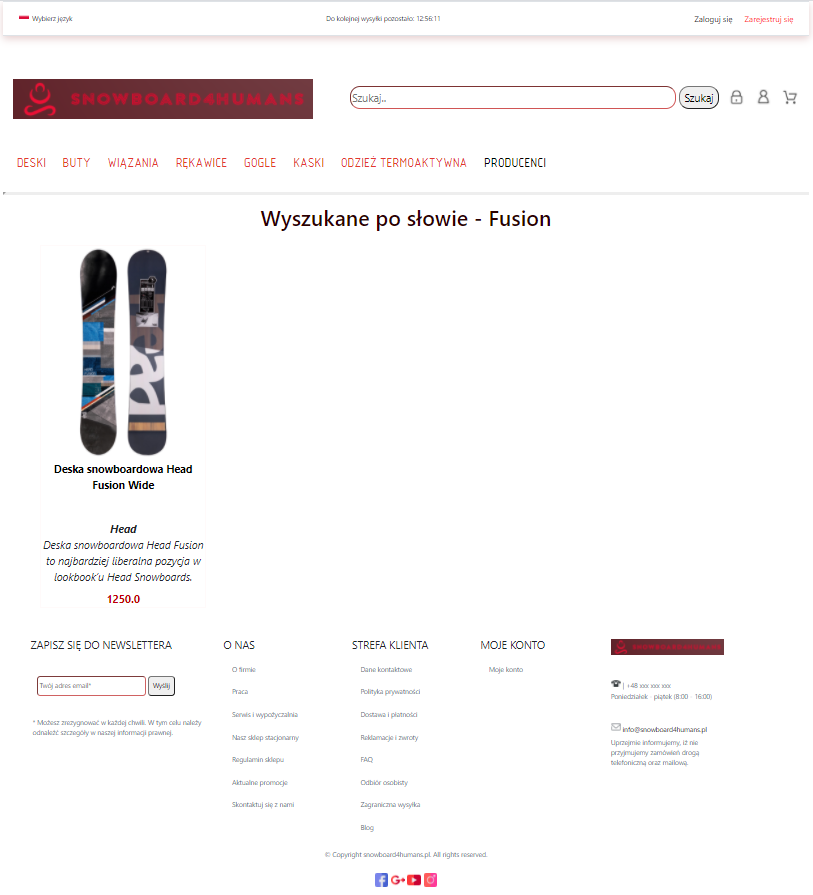

# Snowboard 4 humans - website
## 1 Introduction
_Website with accessories for snowboard. This application was created to train JAVA backend, while the frontend was created in order to present the progress._
_It is not website for any existing shop_

Frontend of page was based on https://snowboardowy.pl/.

## 2 Table of Contents
- [Introduction](#1-Introduction)
- [Table of Contents](#2-Table-of-Contents)
- [How to run ?](#3-how-to-run-)
- [Description of user pages and admin pages](#4-Description-of-user-pages-and-admin-pages)
  - [Homepage - for users](#41-Homepage---for-users)
  - [Homepage - for admins](#42-Homepage---for-admins)
- [TODO list](#5-TODO-list)
## 3 How to run ?

Download from this link: https://github.com/berNy92k/Snowboard4HumansWebApp_DB and run using for example Intellij

or

use link from heroku: TODO

## 4 Description of user pages and admin pages
Below you will be able to see short description with images for:

- user pages
- admin pages

### 4.1 Homepage - for users
Screens with homepage view for clients/ users.

##### 4.1.1 Homepage - Navigation Bar
User can choose the type of equipment and gender.

 *the type of equipment 
 - snowboards
 - snowboard shoes
 - snowboard bindings
 - snowboard gloves
 - snowboard helmets
 - thermoactive clothing
 - manufacturers
 
 *gender
 - For Men
 - For Women
 - For Childen
 

##### 4.1.2 Homepage - Equipment exist in DB 
Example after select equipment type with gender - when equipments exist in DB

##### 4.1.3 Homepage - Equipment not exist in DB
Example after select equipment type with gender - when equipments not exist in DB

##### 4.1.4 Homepage - Manufacturers
Example page with manufacturers.

##### 4.1.5 Homepage - Search Button
Example how search button is working.

 
### 4.2 Homepage - for admins
Screens with homepage view for admins

TODO

## 5 TODO list
* Create website by using SpringBoot and Thymeleaf
* Update README.md
